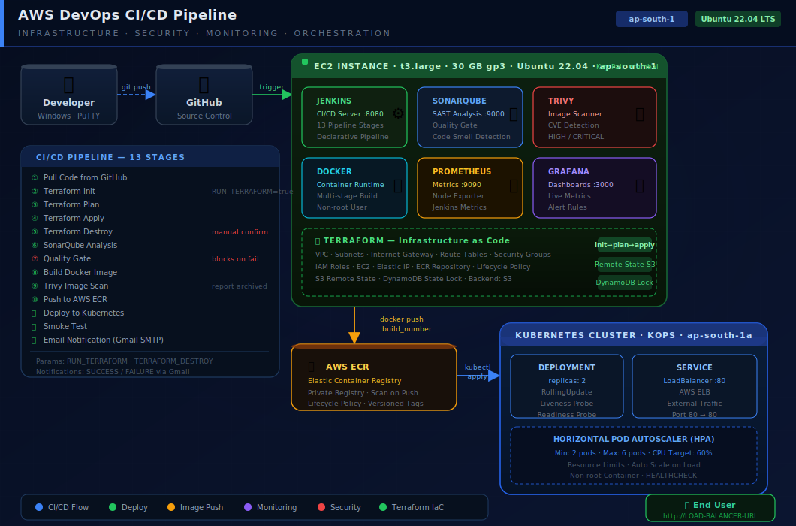

# AWS DevOps CI/CD Pipeline — 
<div align="center">



**Production-grade CI/CD pipeline on AWS**

[](https://www.jenkins.io/)
[](https://www.docker.com/)
[](https://kubernetes.io/)
[](https://www.terraform.io/)
[](https://aws.amazon.com/)
[](https://www.sonarqube.org/)
[](https://prometheus.io/)
[](https://grafana.com/)

</div>

---

## Table of Contents

- [Overview](#overview)
- [Tech Stack](#tech-stack)
- [Project Structure](#project-structure)
- [Pipeline Stages](#pipeline-stages)
- [Prerequisites](#prerequisites)
- [Quick Start](#quick-start)
- [Service URLs](#service-urls)
- [Monitoring & Alerts](#monitoring--alerts)
- [Troubleshooting](#troubleshooting)
---

## Overview

A single EC2 instance (Ubuntu 22.04, t3.large, ap-south-1) runs Jenkins, Docker, SonarQube, Trivy, Prometheus, and Grafana. Every code push to GitHub triggers a 13-stage Jenkins pipeline that:

- Scans code for bugs and vulnerabilities (SonarQube + Quality Gate)
- Builds a Docker image and scans it for CVEs (Trivy)
- Pushes the image to AWS ECR
- Deploys to a Kubernetes cluster provisioned by KOPS
- Runs a smoke test to confirm the app is live
- Sends an email notification with the result

All AWS infrastructure is provisioned with **Terraform** (IaC). Application metrics are scraped by **Prometheus** and displayed on **Grafana** dashboards with active alert rules.

---

## Tech Stack

| Tool | Role | Port |
|------|------|------|
| Jenkins | CI/CD orchestration — 13-stage declarative pipeline | 8080 |
| SonarQube | Static code analysis (SAST) + Quality Gate | 9000 |
| Docker | Multi-stage container build, non-root user | — |
| Trivy | Docker image CVE scan (HIGH / CRITICAL) | — |
| AWS ECR | Private Docker registry | — |
| KOPS + Kubernetes | Cluster on AWS — HPA, Probes, RollingUpdate | — |
| Terraform | IaC — VPC, EC2, ECR, IAM, S3, DynamoDB | — |
| Prometheus | Metrics scraping — Jenkins, Node Exporter, App | 9090 |
| Grafana | Live dashboards + alerting | 3000 |
| FastAPI | Python web application — `/` and `/health` endpoints | 80 |

---

## Project Structure

```
devops-project/
│
├── architecture.svg              ← Architecture diagram (renders on GitHub)
├── Dockerfile                    ← Multi-stage build, non-root user, HEALTHCHECK
├── Jenkinsfile                   ← 13-stage declarative pipeline
├── main.py                       ← FastAPI app
├── form.html                     ← Frontend page
├── requirements.txt              ← Pinned Python dependencies
├── sonar-project.properties      ← SonarQube project config
├── README.md
├── .gitignore
│
├── kubernetes/
│   └── pod.yaml                  ← Deployment + LoadBalancer Service + HPA
│
├── terraform/
│   ├── main.tf                   ← All AWS resources
│   ├── variables.tf
│   ├── outputs.tf                ← Prints Jenkins URL, ECR URL after apply
│   ├── locals.tf
│   ├── terraform.tfvars.example  ← Copy → terraform.tfvars  (never commit!)
│   └── scripts/
│       └── jenkins-setup.sh      ← EC2 bootstrap script
│
├── monitoring/
│   ├── prometheus.yml            ← Scrape config
│   ├── alert.rules.yml           ← CPU, Memory, Disk, App Down alerts
│   └── grafana-dashboard.json    ← Import directly into Grafana
│
├── screenshots/                  ← Add your screenshots here after setup
│   └── README.md                 ← Screenshot guide
│
└── .github/
    └── workflows/
        └── validate.yml          ← PR checks: Terraform fmt, Python lint
```

---

## Pipeline Stages

```
Code Push to GitHub
        │
        ▼
 Stage  1  ─  Pull Code from GitHub
 Stage  2  ─  Terraform Init          (only when RUN_TERRAFORM = true)
 Stage  3  ─  Terraform Plan
 Stage  4  ─  Terraform Apply
 Stage  5  ─  Terraform Destroy       (requires manual confirmation)
 Stage  6  ─  SonarQube Analysis      SAST scan
 Stage  7  ─  Quality Gate            BLOCKS pipeline if quality fails
 Stage  8  ─  Build Docker Image      multi-stage, tagged :build_number
 Stage  9  ─  Trivy Image Scan        CVE report archived as artifact
 Stage 10  ─  Push to AWS ECR         :build_number + :latest
 Stage 11  ─  Deploy to Kubernetes    kubectl apply + rollout status
 Stage 12  ─  Smoke Test              curl the LoadBalancer URL
 Stage 13  ─  Email Notification      Gmail SMTP — SUCCESS / FAILURE
```

---

## Prerequisites

- AWS account with IAM user (EC2, ECR, VPC, S3, DynamoDB, IAM permissions)
- EC2 key pair named **`mumbai`** (Linux format, `.pem`)
- Windows laptop with PuTTY and Git Bash installed
- Gmail account with 2-Step Verification enabled (needed for App Password)
- GitHub account

---

## Quick Start

### 1 — Launch EC2 on AWS

```
AWS Console → EC2 → Launch Instance

  Name:           jenkins-server
  AMI:            Ubuntu Server 22.04 LTS
  Instance type:  t3.large
  Key pair:       mumbai  (Linux)
  Storage:        30 GB  gp3
  Security group: open ports  22 · 8080 · 9000 · 9090 · 3000 · 80
```

### 2 — Connect via PuTTY

```
Host Name:  ubuntu@YOUR-EC2-IP
Port:       22
Connection → SSH → Auth → Credentials → browse to mumbai.ppk
```

### 3 — Install All Tools (run in PuTTY)

```bash
# Update
sudo apt update && sudo apt upgrade -y

# Java 21 (Jenkins requirement)
sudo apt install fontconfig openjdk-21-jre -y

# Jenkins
sudo wget -O /etc/apt/keyrings/jenkins-keyring.asc \
  https://pkg.jenkins.io/debian-stable/jenkins.io-2026.key
echo "deb [signed-by=/etc/apt/keyrings/jenkins-keyring.asc] \
  https://pkg.jenkins.io/debian-stable binary/" | \
  sudo tee /etc/apt/sources.list.d/jenkins.list > /dev/null
sudo apt update && sudo apt install jenkins -y
sudo systemctl enable jenkins && sudo systemctl start jenkins

# Docker
sudo apt install docker.io -y
sudo usermod -aG docker jenkins
sudo usermod -aG docker ubuntu
sudo chmod 666 /var/run/docker.sock

# See DevOps_Complete_Guide.docx Phase 3 for full install commands
# (AWS CLI, kubectl, Trivy, Sonar Scanner, SonarQube, Prometheus, Grafana)
```

### 4 — Create S3 Bucket for Terraform State

```bash
aws s3 mb s3://ganesh-tf-state-bucket --region ap-south-1
aws s3api put-bucket-versioning \
  --bucket ganesh-tf-state-bucket \
  --versioning-configuration Status=Enabled

# DynamoDB for state locking
aws dynamodb create-table \
  --table-name tf-state-lock \
  --attribute-definitions AttributeName=LockID,AttributeType=S \
  --key-schema AttributeName=LockID,KeyType=HASH \
  --billing-mode PAY_PER_REQUEST \
  --region ap-south-1
```

### 5 — Push Code to GitHub

```bash
git init
git add .
git commit -m "Initial commit - AWS DevOps CI/CD pipeline"
git branch -M main
git remote add origin https://github.com/YOUR-USERNAME/devops-fastapi-project.git
git push -u origin main
```

### 6 — Run Terraform

```bash
cd ~/devops-fastapi-project/terraform
cp terraform.tfvars.example terraform.tfvars
# Edit terraform.tfvars — set key_pair_name = "mumbai"
terraform init
terraform plan
terraform apply
```

### 7 — Create Kubernetes Cluster (KOPS)

```bash
aws s3 mb s3://ganesh-kops-state --region ap-south-1
export KOPS_STATE_STORE=s3://ganesh-kops-state

kops create cluster \
  --name=ganesh.k8s.local \
  --state=s3://ganesh-kops-state \
  --zones=ap-south-1a \
  --node-count=2 \
  --node-size=t3.medium \
  --control-plane-size=t3.medium \
  --dns=private \
  --yes

# Wait ~15 minutes
kops validate cluster --name=ganesh.k8s.local --wait 15m

# Give Jenkins access
sudo mkdir -p /var/lib/jenkins/.kube
sudo cp ~/.kube/config /var/lib/jenkins/.kube/config
sudo chown -R jenkins:jenkins /var/lib/jenkins/.kube
```

### 8 — Trigger the Pipeline

```
Jenkins → your pipeline → Build with Parameters → Build
```
---

## Service URLs

| Service | URL | Default Login |
|---------|-----|---------------|
| Jenkins | `http://EC2-IP:8080` | admin / set on first run |
| SonarQube | `http://EC2-IP:9000` | admin / set on first run |
| Prometheus | `http://EC2-IP:9090` | no login required |
| Grafana | `http://EC2-IP:3000` | admin / Admin@123 |

---

## Monitoring & Alerts

### Prometheus Scrape Targets

| Job | Target | Metrics |
|-----|--------|---------|
| `jenkins` | `localhost:8080/prometheus` | Build count, duration, queue length |
| `node-exporter` | `localhost:9100` | CPU, Memory, Disk, Network |
| `fastapi-app` | `LOAD-BALANCER:80` | App health, uptime |

### Grafana Dashboards

| Dashboard | How to import |
|-----------|--------------|
| Project dashboard | Upload `monitoring/grafana-dashboard.json` |
| Node Exporter Full | Grafana marketplace ID: **1860** |

### Alert Rules

| Alert | Condition | Severity |
|-------|-----------|----------|
| High CPU Usage | > 80% for 2 min | Warning |
| High Memory Usage | > 85% for 2 min | Warning |
| Low Disk Space | > 80% full | Critical |
| Application Down | unreachable for 1 min | Critical |
| Jenkins Down | unreachable for 2 min | Critical |

---

## Useful Commands

```bash
# Check running Docker containers
docker ps

# Restart a service
docker restart sonarqube
docker restart prometheus
docker restart grafana

# Kubernetes
kubectl get pods
kubectl get svc fastapi-svc
kubectl get hpa
kubectl logs -l app=fastapi --tail=30

# Reload Prometheus config without restart
curl -X POST http://localhost:9090/-/reload

# Free up disk space
docker image prune -f
```

---

## Troubleshooting

| Problem | Solution |
|---------|----------|
| `docker: permission denied` | `sudo usermod -aG docker jenkins && sudo systemctl restart jenkins` |
| `sonar-scanner: not found` | `source /etc/environment` — verify PATH has `/opt/sonar-scanner/bin` |
| Quality Gate hangs 5 min | SonarQube → Administration → Webhooks → Create → URL: `http://localhost:8080/sonarqube-webhook/` |
| ECR push failed | Verify `aws-creds` credential in Jenkins has correct Access Key and Secret |
| `kubectl: no config` | `sudo chown -R jenkins:jenkins /var/lib/jenkins/.kube` |
| Trivy permission denied | `sudo chown -R jenkins:jenkins /var/lib/jenkins/.cache/trivy` |
| Grafana shows no data | Data source URL must be `http://localhost:9090` → click Save & Test |
| SonarQube not loading | `docker logs sonarqube --tail=20` — wait 2 minutes after container start |
| Smoke test fails | LoadBalancer takes 2–3 min to become active — pipeline retries automatically |

---

## Improvements Over a Basic Setup

| Feature | Basic | This Project |
|---------|-------|-------------|
| Docker image | Single-stage | Multi-stage (smaller + more secure) |
| Container user | root | Non-root `appuser` |
| Kubernetes | Raw pod | Deployment + HPA + health probes |
| Deploy strategy | Replace | RollingUpdate (zero downtime) |
| SonarQube | Analysis only | Quality Gate (blocks bad code) |
| Security scan | None | Trivy CVE scan, archived as artifact |
| Infrastructure | Manual | Terraform IaC |
| Monitoring | None | Prometheus + Grafana + alert rules |
| Health check | None | `/health` endpoint + K8s probes |
